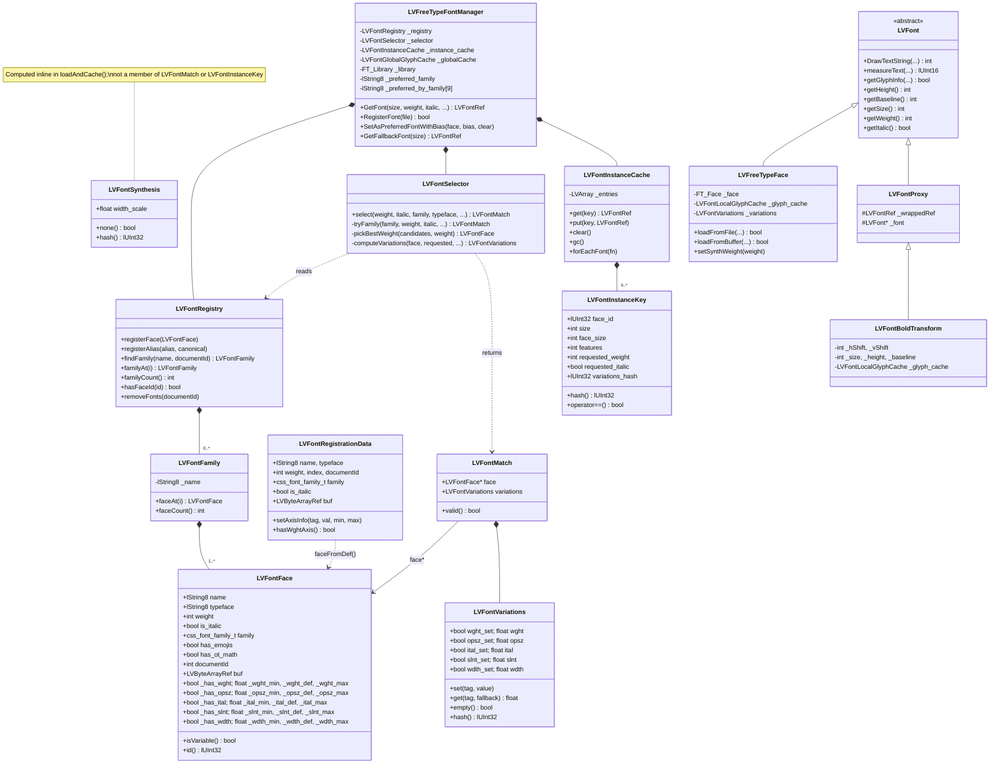

# Font Manager Refactor — Architecture & Implementation Plan

## Motivation

The current font manager has accumulated significant complexity over time:

- `LVFontCache` mixes registered font descriptors and loaded instances in the same
  structure, making every lookup ambiguous about what it is returning.
- `cache.find()` uses `CalcMatch()` to score every entry in the cache against every
  request, conflating font selection (which font?) with instance lookup (do we have
  this face loaded?).
- `CalcMatch()` encodes font selection rules as a scoring function whose behaviour
  emerges from interactions between a dozen numeric weights and special-case guards
  (`_real_weight`, `italic=2`, `useBias`, the 257 score, the +1 tie-breaker) rather
  than being stated explicitly.
- `GetFont()` makes 3–4 sequential cache lookups with progressively modified keys to
  work around the above, resulting in ~200 lines of logic that are hard to reason about.

The refactor separates these concerns explicitly and replaces the implicit scoring rules
with readable CSS Fonts Level 4 selection logic.

---

## Target Architecture

### Three distinct concerns

```
┌─────────────────────┐     ┌──────────────────┐     ┌───────────────────────┐
│   LVFontRegistry    │────▶│  LVFontSelector  │────▶│  LVFontInstanceCache  │
│  (what fonts exist) │     │  (which to use)  │     │  (loaded instances)   │
└─────────────────────┘     └──────────────────┘     └───────────────────────┘
```

### Class diagram



### LVFontFace

One instance per physical font face. Replaces the registered-font role of `LVFontDef`.

```cpp
struct LVFontFace {
    lString8           file;
    int                face_index;
    int                weight;          // design weight (100–1000)
    bool               is_italic;
    css_font_family_t  family;          // monospace etc.
    bool               has_emojis;
    bool               has_ot_math;
    // Variable font axis ranges (min==max==def for static fonts)
    bool  _has_wght; float _wght_min, _wght_def, _wght_max;
    bool  _has_opsz; float _opsz_min, _opsz_def, _opsz_max;
    bool  _has_ital; float _ital_min,  _ital_def, _ital_max;
    bool  _has_slnt; float _slnt_min,  _slnt_def, _slnt_max;
    bool  _has_wdth; float _wdth_min,  _wdth_def, _wdth_max;
    // Document-embedded fonts
    int            documentId;
    LVByteArrayRef buf;

    bool     isVariable() const { return _has_wght && _wght_min < _wght_max; }
    lUInt32  id() const;  // stable hash of (file, face_index, documentId)
};
```

Static and variable fonts share the same struct. For static fonts all axis ranges have
min==max==def. This gives the selector a uniform representation and naturally supports
font families with more than 4 faces.

### LVFontFamily

Groups all faces under one name.

```cpp
class LVFontFamily {
    lString8             _name;
    LVArray<LVFontFace>  _faces;
public:
    void addFace(const LVFontFace&);
    const LVArray<LVFontFace>& faces() const;
};
```

### LVFontSynthesis

Explicit synthesis decision. Part of the cache key, so two instances with different
synthesis (e.g. with and without `font-synthesis: none`) coexist correctly.

```cpp
struct LVFontSynthesis {
    bool  bold;           // FT_EMBOLDEN or LVFontBoldTransform
    bool  italic;         // FreeType slant transform
    float width_scale;    // 1.0 = none; implements font-stretch synthesis

    bool    none()   const { return !bold && !italic && width_scale == 1.0f; }
    bool    operator==(const LVFontSynthesis&) const;
    lUInt32 hash()   const;
};
```

Adding small-caps synthesis in future is a one-field extension with no structural change.
The `font-synthesis` CSS property gates which fields the selector is allowed to set.

### LVFontRegistry

Registered faces only — no instances.

```cpp
class LVFontRegistry {
public:
    void               registerFace(const LVFontFace&);
    void               registerAlias(lString8 alias, lString8 canonical);
    const LVFontFamily* findFamily(lString8 name, int documentId = -1) const;
    void               removeFonts(int documentId);      // embedded font cleanup
    lUInt32            getHash(int documentId) const;    // for GetFontListHash()
private:
    LVHashTable<lString8, LVFontFamily>  _families;  // keyed by lowercase name
    LVHashTable<lString8, lString8>      _aliases;
};
```

### LVFontSelector

Pure function — no cache access, no loading.

```cpp
struct LVFontMatch {
    const LVFontFace*  face;        // nullptr if no candidates found
    LVFontSynthesis    synthesis;
    LVFontVariations   variations;  // effective axes after selection
};

class LVFontSelector {
public:
    LVFontMatch select(int weight, bool italic,
                       css_font_family_t family,
                       const lString8&   typeface,
                       int               documentId,
                       const LVFontVariations& requested,
                       const LVFontRegistry&   registry,
                       const lString8&   preferred_family) const;
private:
    const LVFontFace* pickFace(const LVFontFamily&,
                                int weight, bool italic) const;
    LVFontSynthesis   computeSynthesis(const LVFontFace&,
                                       int weight, bool italic) const;
    LVFontVariations  effectiveVariations(const LVFontFace&,
                                          const LVFontVariations&) const;
};
```

`pickFace()` implements CSS Fonts Level 4 §9 selection explicitly:
1. Filter candidates by italic preference; if none, use all (synthesis will cover the gap).
2. Apply the spec weight tiebreak: for weight < 400, try lower then higher; for weight
   > 500, try higher then lower; for 400–500, try in range first.

This replaces `CalcMatch()` entirely and is reviewable against the spec line by line.
The `useBias` mechanism becomes `preferred_family` — a string prepended to the lookup
rather than a scoring trick baked into cache entries.

### LVFontInstanceKey and LVFontInstanceCache

```cpp
struct LVFontInstanceKey {
    lUInt32          face_id;        // from LVFontFace::id()
    int              size;           // requested pixel size
    int              face_size;      // actual loaded size (monospace scaling)
    LVFontSynthesis  synthesis;
    lUInt32          features_hash;
    lUInt32          variations_hash;

    bool    operator==(const LVFontInstanceKey&) const;
    lUInt32 hash() const;
};

class LVFontInstanceCache {
public:
    LVFontRef get(const LVFontInstanceKey&) const;
    void      put(const LVFontInstanceKey&, LVFontRef);
    void      evict(lUInt32 face_id);   // embedded font cleanup
    void      gc();
private:
    LVHashTable<LVFontInstanceKey, LVFontRef> _table;
};
```

Lookup is an exact hash-map hit. No scoring, no ambiguity about whether a registered
entry or an instance is being returned.

Cache key notes:
- `face_id` encodes which physical file was selected; weight of static fonts is implicit.
- `synthesis` separates emboldened from non-emboldened instances of the same face.
- Multiple weight requests resolving to the same static face with the same synthesis
  share one cache entry — no duplication.
- Synthesis-from-synthesis is architecturally impossible: the selector reads from
  `LVFontRegistry` (physical faces only), never from the instance cache.

### GetFont() after refactor

```cpp
LVFontRef GetFont(int size, int weight, bool italic,
                  css_font_family_t family, lString8 typeface,
                  int features, int documentId, bool useBias,
                  const LVFontVariations* variations)
{
    // 1. Select face + synthesis
    LVFontVariations req_var = variations ? *variations : LVFontVariations();
    lString8 preferred = useBias ? _preferred_family : lString8();
    LVFontMatch m = _selector.select(weight, italic, family, typeface,
                                     documentId, req_var,
                                     _registry, preferred);
    if (!m.face) return LVFontRef(NULL);

    // 2. Build cache key
    int face_size = computeFaceSize(size, m.face->family);  // monospace scaling
    LVFontInstanceKey key {
        m.face->id(), size, face_size,
        m.synthesis,
        (lUInt32)features,
        m.variations.hash()
    };

    // 3. Cache hit
    LVFontRef cached = _instance_cache.get(key);
    if (!cached.isNull()) return cached;

    // 4. Load, synthesise, cache
    return loadAndCache(*m.face, size, face_size,
                        m.synthesis, features, m.variations, key);
}
```

### RegisterFont() after refactor

```cpp
bool RegisterFont(lString8 file, ...)
{
    for each face in file:
        LVFontFace f = inspectFace(file, index);
        // inspectFace reads weight, italic, family, axis ranges,
        // emoji/OT-math flags from the FreeType face.
        _registry.registerFace(f);
    return true;
}
```

Duplicate detection: check whether a face with the same `id()` is already registered.
`CalcDuplicateMatch()` is removed.

---

## What Is Removed

| Removed | Replaced by |
|---------|-------------|
| `LVFontDef` | `LVFontFace` (registry) + `LVFontInstanceKey` (cache) |
| `LVFontCacheItem` | `LVFontInstanceCache` entries |
| `LVFontCache` | `LVFontRegistry` + `LVFontInstanceCache` |
| `CalcMatch()` | `LVFontSelector::pickFace()` |
| `CalcDuplicateMatch()` | `face.id()` uniqueness check |
| `CalcFallbackMatch()` | Same selector, separate fallback family list |
| `useBias` scoring trick | `preferred_family` string passed to selector |
| `_real_weight` guard | Cache key encodes synthesis; synthesis-from-synthesis impossible |
| `italic=2` in CalcMatch | `LVFontSynthesis.italic` flag in key |
| 257 variable-font score | Selector prefers exact axis match over nearest-static naturally |
| Multi-phase GetFont lookups | Single select → lookup → load |

---

## What Is Preserved

- `LVFreeTypeFace` — the FreeType/HarfBuzz rendering class is unchanged. Changes stop
  at the boundary between selection and instantiation.
- `LVFontManager` public virtual API — same interface for callers (lvrend, lvdocview).
- CSS parsing (lvstsheet.cpp) — unchanged.
- All variable-font axis logic (opsz injection, ital/slnt handling) moves cleanly into
  `LVFontSelector::effectiveVariations()` and `computeSynthesis()`.

---

## OpenType Features

The current `int features` (32-bit bitmap) is a separate improvement opportunity.
Replacing it with an open-ended `LVFontFeatureSet` (vector of `hb_feature_t`) would:
- Remove the 32-feature limit
- Support numeric feature values (not just on/off)
- Pass through directly to HarfBuzz without the bitmap translation layer

This is compatible with the refactor but is a separate step. For now `features` remains
as `int` in the cache key.

---

## CSS Compliance Improvements

| Property | Current | After refactor |
|----------|---------|----------------|
| Font matching algorithm | CalcMatch scoring | CSS Fonts Level 4 §9 steps, explicit |
| Weight tiebreak | +1 hack for lower weight | Spec rules: direction depends on requested weight |
| `font-synthesis` | Not honoured | Selector gates synthesis per property |
| Italic vs oblique | Not distinguished | Separate handling possible |
| `font-feature-settings` | 32-bit bitmap | Open-ended (future step) |
| Family list fallback | CalcMatch side-channel | Explicit outer loop in selector |
| >4 faces per family | Not supported | Free: selector iterates all candidates |

---

## Known Boundary Cases

1. **Family name fragmentation** — fonts that split weights across multiple metadata
   family names appear as separate families. Requires CSS `@font-face` or a
   normalisation pass; not addressed in this refactor.

2. **Document-embedded font scoping** — `documentId` must be explicit in both the
   registry and the cache key to prevent cross-document contamination.

3. **Font list changes between sessions** — `face_id` should include a hash of the
   registration-time metadata so changes are detected on next open.

4. **Alias fonts** — `SetAlias()` registers a second name for an existing face.
   `LVFontRegistry` tracks aliases explicitly and resolves them at lookup time.

5. **Width synthesis and layout metrics** — `width_scale != 1.0` changes advance widths
   and must be included in the document rendering hash, not just the font instance hash.

6. **Monospace size scaling** — `face_size` may differ from `size`; both must be in the
   cache key.

---

## Implementation Plan (Incremental)

Each step leaves the codebase in a working state.

### Step 1 — Introduce LVFontFace and LVFontRegistry alongside existing cache ✓ DONE

- Add `LVFontFace`, `LVFontFamily`, `LVFontRegistry` as new types in `lvfntman.cpp`.
- Make `RegisterFont()` and `SetAlias()` write to both `_registry` and the existing
  `_cache`. The cache remains the authoritative path for `GetFont()`.
- Verify: all existing font registration tests pass; both structures contain the same
  fonts.

**As-built notes:**

- Three additional typed axis accessors were added to `LVFontDef`
  (`hasOpszAxis/getOpszAxisMin/Max`, `hasWdthAxis/getWdthAxisMin/Max`) to support
  `faceFromDef()`. The generic `getAxisMin(tag)` / `getAxisMax(tag)` were previously
  removed as unused; the typed variants are consistent with the existing
  `getWghtAxisMin/Max` pattern.

- `faceFromDef()` sets `_opsz_def = _opsz_min` (and similarly for ital, slnt, wdth)
  as a placeholder. For non-variable fonts min==max==def so this is correct; for
  variable fonts the real def comes from the FreeType axis descriptor (accessible at
  registration time but not currently stored separately in `LVFontDef`). This can be
  improved in a later step by reading `mm_var->axis[i].def` directly.

- Four registration paths exist, not three as originally assumed: (1) FontConfig
  (Linux/Android), (2) SetAlias, (3) file-based with explicit faceName parameter,
  (4) file-based without faceName (the primary path KOReader uses). Path 4 was
  missed in Step 1 and discovered in Step 4 when the registry was empty at runtime.

- `_preferred_family` (lString8) was added to `LVFreeTypeFontManager` alongside
  `_registry` as a placeholder for the `useBias` replacement in Step 5.

**Test EPUB:** `tests/font-manager-test.epub` — covers weight progression (100–900,
CSS4 intermediates 550/650), italic/bold-italic, font-synthesis, optical sizing
(auto vs none), and font-stretch keywords. Baseline regression samples on the
final page confirm default roman/sans/mono rendering is unchanged.

### Step 2 — Implement LVFontSelector as a standalone function ✓ DONE

- Add `LVFontSelector` with `select()` using CSS Fonts Level 4 §9 logic.
- Wire up a parallel path in `GetFont()` that calls the selector and logs its result
  alongside the existing CalcMatch result. Assert they agree.
- Fix any discrepancies; this surfaces edge cases safely.

**As-built notes:**

- `familyAt(int i)` added to `LVFontRegistry` to support generic-family fallback
  iteration in the selector.

- `LVFontSynthesis` was defined here (not in a separate step as originally planned),
  immediately before `LVFontMatch` which depends on it. It holds `bold` (bool),
  `italic` (bool), and `width_scale` (float, 1.0 = none).

- `LVFontMatch` carries the selected face, a `LVFontSynthesis`, and the effective
  `LVFontVariations` (axes to apply at instantiation time).

- The selector's four-tier fallback mirrors the current CalcMatch priority:
  (1) exact typeface name → (2) user preferred family → (3) generic family type
  (monospace/serif/sans-serif) → (4) any registered face.

- Parallel verification logs `CRLog::warn()` mismatches unconditionally (no special
  build flag needed). The comparison is skipped for instantiated cache entries since
  only registered entries have a directly comparable file+index. Any mismatch printed
  during `tests/font-manager-test.epub` review should be investigated before Step 4.

- `LVFontVariations` default constructor leaves all axes unset, so the `LVFontMatch`
  default constructor correctly produces an empty variations set.

**Test:** Open `tests/font-manager-test.epub` and check the KOReader log for any
`FontSelector mismatch` warnings. Expected: zero warnings for standard system fonts.

### Step 3 — Introduce LVFontSynthesis and LVFontInstanceCache ✓ DONE

- Add `LVFontSynthesis` and `LVFontInstanceKey`.
- Add `LVFontInstanceCache` populated alongside the existing cache.
- In `GetFont()`, check the new cache first; fall back to existing path if missed.
- Verify: hit rates are as expected; no stale instances returned.

**As-built notes:**

- `LVFontSynthesis` was already added in Step 2; Step 3 adds `LVFontInstanceKey`
  and `LVFontInstanceCache`.

- `LVFontInstanceKey` includes `requested_weight` (the original pre-snapping weight)
  alongside the snapped `variations_hash`. This is necessary because wght snapping
  maps both a w=400 and a w=700 request to the same 400-weight face, producing
  identical `variations_hash` values — but the w=700 request requires bold synthesis
  while the w=400 does not. Without `requested_weight` in the key, the instance cache
  would return the non-synthesised entry for the synthesised request (confirmed bug).
  `requested_weight` is a temporary stand-in; it will be replaced by a proper
  `LVFontSynthesis` field in Step 4.

- The instance cache check is placed AFTER all existing early-return paths (block 1,
  slnt translation, existing-instance return). Those paths are fast already (they
  hit `_cache` directly). The instance cache speeds up the main load path — the
  one that would otherwise call `loadFromFile`/`loadFromBuffer`. This placement will
  move earlier in Step 4.

- `LVFontInstanceCache::clear()` is called from `UnregisterDocumentFonts()` since
  per-face eviction is not yet implemented. This is conservative but correct; it
  also clears global font instances (wasteful but safe). Per-face eviction using
  `face_id` will be wired up in Step 4 or 5.

- `makeFaceId()` is a free static helper that produces a stable hash of
  (file, face_index, documentId) from a `LVFontDef*`, matching `LVFontFace::id()`.

**Test:** Open `tests/font-manager-test.epub`. With debug logging, verify that
repeated font requests within the document produce instance-cache hits (log
`FontSelector mismatch` count should remain zero).

### Step 4 — Switch GetFont() to the new path ✓ DONE

- Replace `GetFont()` body with the three-step select → lookup → load flow.
- Remove the multi-phase lookup blocks.
- Keep `LVFontCache` alive temporarily for `GetFallbackFont()` and `GetFontList()`.

**As-built notes:**

- `loadAndCache()` is a new private method on `LVFreeTypeFontManager` that loads a
  face, applies synthesis, writes to both `_cache` (for backward compat) and
  `_instance_cache`, and returns the font ref.

- `LVFontSynthesis` gained `operator==` and `hash()` so it can be part of
  `LVFontInstanceKey`. `requested_weight` (the Step 3 workaround) is replaced by
  `LVFontSynthesis synthesis`.

- `computeSynthesis()` in `LVFontSelector` now uses the correct platform thresholds:
  `myabs(weight - face.weight) >= 25` for `USE_FT_EMBOLDEN`, and
  `weight - face.weight >= 200` for `LVFontBoldTransform`.

- `SetAsPreferredFontWithBias()` now also sets `_preferred_family` so the selector
  uses it as the Step 2 preferred-name fallback.

- The old ~320-line `GetFont()` body is deleted entirely. `_cache` remains populated
  (via `loadAndCache()` calling `_cache.update()`) so `GetFallbackFont()`,
  `GetFontList()`, and `GetAvailableFontWeights()` continue to work.

- The Step 2 parallel verification block was removed with the old body. Any remaining
  disagreements between `_selector` and `_cache` are now irrelevant since `_selector`
  is the sole authority.

- CSS font-family names may arrive with surrounding double-quotes preserved (e.g.
  `'"Literata"'` rather than `'Literata'`). Quote stripping was added to `findFamily()`
  as a workaround, but the correct fix is to strip quotes in the CSS parser at the
  point where `font-family` values are resolved to `style->font_name` — before they
  ever reach the font manager. The workaround in `findFamily()` should be removed
  once the CSS layer is fixed.

**Test:** Open `tests/font-manager-test.epub`. Chapter 1 should show weight progression;
Chapter 2 should show correct bold-italic (distinct from normal italic) for both serif
and sans-serif.

### Step 5 — Migrate fallback font and font list APIs ✓ DONE

- Replace `GetFallbackFont()` with a selector call over the fallback family list.
- Replace `GetFontList()` / `GetFontListHash()` with registry-based equivalents.
- Remove `LVFontCache`.

**As-built notes:**

- `GetFallbackFont(size)` — removed `_cache.findFallback()` call; delegates directly
  to `GetFont()` which uses the selector. The validity check for fallback font names
  in `SetFallbackFontFaces()` now uses `_registry.findFamily()` instead.

- `GetFontListHash()` — rebuilt from `_registry`: hash of (file, face_index, weight,
  is_italic) per face. Multiplied by 75 and combined with `_fallbackFontFacesString`
  hash, matching the old formula's structure.

- `getFaceList()` — rebuilt from `_registry`: unique family names, sorted.

- `GetFontCount()` — now returns `_registry.familyCount()`.

- `GetAvailableFontWeights()` — rebuilt from `_registry` for the given typeface.

- `SetAntialiasMode/SetHintingMode/SetKerningMode/clearGlyphCache` — migrated from
  `_cache.getInstances()` to `_instance_cache.forEachFont()` (a new template method).

- `SetFallbackFontSizesAdjusted()` — `_cache.clearFallbackFonts()` removed; a `gc()`
  call releases any unreferenced instances instead.

- **`LVFontCache` not fully removed.** The following still use it and are deferred to
  Step 6: `getFontFileNameList()`, `regularizeRegisteredFontsWeights()`,
  `findDocumentFontDuplicate()`, `getRegisteredDocumentFontList()`,
  `getInstantiatedDocumentFontList()`, `SetAlias()` (uses `_cache.find()`), and the
  destructor. The `loadAndCache()` function still writes to `_cache` for these users.
  Full removal requires either migrating these APIs to the registry or determining
  they can be dropped.

### Step 6 — Remove LVFontDef and CalcMatch ✓ DONE

- Delete `LVFontDef`, `LVFontCacheItem`, `LVFontCache`.
- Delete `CalcMatch()`, `CalcDuplicateMatch()`, `CalcFallbackMatch()`.
- Clean up any remaining references.

**As-built notes:**

- `LVFontDef` is replaced by `LVFontRegistrationData` — a minimal ~80-line class
  (vs the original ~500 lines) that accumulates FreeType face data during
  `RegisterFont()` before `faceFromDef()` converts it to an `LVFontFace`. All
  CalcMatch scoring, bias, real_weight tracking, and size fields are removed.
  The rename makes its purpose explicit and avoids confusion with the full old class.

- `LVFontCache`, `LVFontCacheItem`, `CalcMatch()`, `CalcDuplicateMatch()`,
  `CalcFallbackMatch()`, and their ~600 lines of out-of-class method definitions
  are deleted entirely.

- `LVFontCache._cache` member removed from `LVFreeTypeFontManager`. The destructor,
  `gc()`, `SetFallbackFontFaces()`, `SetAsPreferredFontWithBias()`,
  `UnregisterDocumentFonts()`, and `loadAndCache()` are all cleaned up.

- Registration duplicate detection now uses `LVFontRegistry::hasFaceId()` (a hash
  of file + face_index + documentId) instead of `CalcDuplicateMatch()`.

- `SetAlias()` rewritten to ~10 lines: find source family in registry, copy faces
  under the alias name, register the alias mapping.

- `RegularizeRegisteredFontsWeights()` converted to a no-op — the selector handles
  weight synthesis explicitly via `computeSynthesis()`.

- `LVBitmapFontManager` and `LVWin32FontManager` still reference `LVFontCache` and
  `LVFontCacheItem`, but both are inside platform-conditional blocks
  (`#if USE_FREETYPE==1` / `#ifdef _WIN32`) that are not compiled on this platform.
  They are left as-is for now and should be migrated or removed separately.

### Step 7 — OpenType features (separate, future)

- Replace `int features` with `LVFontFeatureSet`.
- Update CSS parsing, style hashing, and cache key.
- Cache version bump.

---

## Significant Assumptions

These assumptions were made during the refactor. If any prove incorrect they will
require targeted fixes but do not require re-doing the overall architecture.

### Caller behaviour

**`SetAsPreferredFontWithBias` is called at most twice per session change.**
KOReader calls it once with `clearOthersBias=true` (the reading font) and once
with `clearOthersBias=false` (the monospace companion). The refactor stores
exactly two preferred-family strings keyed on that flag. If a third call with
`clearOthersBias=false` were added for a different purpose (e.g. a cursive
companion), it would silently overwrite the monospace preference.

**The `bias` integer is unused.**
The historical bias value was a `CalcMatch` scoring weight; the new selector
does not score. The parameter is retained for API compatibility but ignored.
If a caller passes a meaningful non-zero bias expecting it to influence
selection, that influence will be silently lost.

**Per-CSS-family preferred fonts are resolved in the CSS layer, not here.**
When a user configures a preferred font for `font-family: serif`, KOReader's
`getFontForFamily()` substitutes the configured name into the CSS font-family
list before `GetFont` is called. The font manager never sees the generic
`css_ff_serif` tag for those requests — step 1 (exact typeface name) matches
directly. The `_preferred_family`/`_preferred_monospace_family` mechanism only
handles the case where no specific name is given at all.

### Font classification

**Only `css_ff_monospace` is meaningful for font selection.**
After removing name-based serif/sans detection, all non-monospace fonts are
registered as `css_ff_sans_serif`. The distinction between serif, sans-serif,
cursive, and fantasy has no effect on selection or synthesis. If OS/2
`sFamilyClass` detection is added in future, step 3 of `select()` will
naturally start using the classification without any other changes.

**Monospace detection via `FT_FACE_FLAG_FIXED_WIDTH` is reliable.**
The fixed-width flag is set by FreeType from the font's `post` table
`isFixedPitch` field, which is standardised and consistently populated. No
known monospace font omits it.

### Instance cache

**`LVArray<Entry>` calls element destructors correctly.**
`LVFontInstanceCache` uses `LVArray<Entry>` where `Entry` holds a
`LVFontRef`. The cache relies on `LVArray::clear()` calling `delete[]` which
runs `~Entry()` (and thus `~LVFontRef()`) for every allocated slot, not just
the live ones. If `LVArray` ever changed to a non-destructing allocator this
would become a resource leak.

**Clearing the full instance cache on reading-font change is acceptable.**
When `SetAsPreferredFontWithBias(face, bias, true)` detects a font change it
calls `_instance_cache.clear()`. This discards all loaded instances, including
fallback and UI fonts unrelated to the reading font. The cost (reloading on
next render) is considered acceptable compared to the complexity of selective
eviction.

### Destruction order

**`_instance_cache.clear()` must be called before `_globalCache.clear()` and
`FT_Done_FreeType`.**
`LVFreeTypeFace` destructors call `FT_Done_Face` (requires a live `FT_Library`)
and flush their local glyph cache (requires a live `LVFontGlobalGlyphCache`).
This ordering is enforced explicitly in the destructor body rather than by
member declaration order, because member declaration order also governs
initialisation and reordering would create other hazards.

### Known pre-existing limitations not addressed by this refactor

**CSS `font-family` lists are not searched sequentially.**
`style->font_name` may contain a comma-separated list such as `"Georgia, Times
New Roman"`. `select()` step 1 treats the whole string as a single typeface
name, which fails to match either face. Step 2 (preferred family) then wins.
This means only single-name `font-family` declarations reliably select the
named font. Multi-name lists are effectively reduced to the preferred reading
font. This was also the case before the refactor.

**Missing-glyph fallback does not consult the CSS font-family list.**
When a glyph is absent from the selected font, the fallback chain goes directly
to the global fallback font list (`_fallbackFontFaces`). The remaining names in
the CSS `font-family:` list (B, C in `font-family: A, B, C`) are never tried
for individual missing glyphs. Fixing this requires per-instance fallback chains
which would conflict with instance cache sharing.

**`@font-face` numeric `font-weight` is coerced to 400/700.**
`epubfmt.cpp`'s `@font-face` parser only recognises the keyword `"bold"`;
numeric weights (`100`–`900`) are discarded. `RegisterDocumentFont` then
receives a boolean and registers the face at weight 400 or 700. A face declared
`font-weight: 100` in an EPUB stylesheet is registered as regular weight,
causing it to compete incorrectly in weight matching. This is a pre-existing bug
in `epubfmt.cpp` outside the scope of this refactor.

**`@font-face` is only parsed from EPUB content, not from styletweaks.**
`lvstsheet.cpp` skips `@font-face` blocks; parsing is done exclusively by
`epubfmt.cpp` at EPUB load time. CSS files processed after that point
(styletweaks, external user CSS) cannot register document fonts.

---

## Files Changed

| File | Change |
|------|--------|
| `crengine/src/lvfntman.cpp` | Core rewrite across steps 1–6 |
| `crengine/include/lvfntman.h` | New public types; `LVFontManager` interface unchanged |
| `crengine/src/lvstyles.cpp` | `calcHash(font_ref_t)` — likely unchanged |
| `crengine/src/lvrend.cpp` | `getFont()` call site — unchanged externally |
| `crengine/src/lvdocview.cpp` | `SetAsPreferredFontWithBias` → `SetPreferredFamily` |
| `crengine/src/lvtinydom.cpp` | Cache version bump at step 4 |
