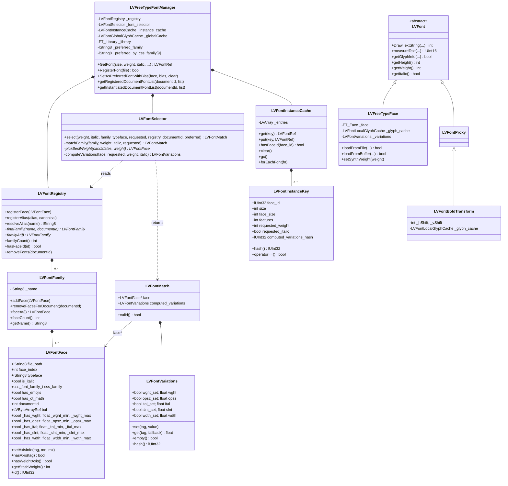

# Font Manager Refactor -- Architecture

## Motivation

The old font manager had accumulated significant complexity:

- `LVFontCache` mixed registered font descriptors and loaded instances in the
  same structure, making every lookup ambiguous about what it was returning.
- `cache.find()` used `CalcMatch()` to score every entry in the cache against
  every request, conflating font selection (which font?) with instance lookup
  (do we have this face loaded?).
- `CalcMatch()` encoded font selection rules as a scoring function whose
  behaviour emerged from interactions between a dozen numeric weights and
  special-case guards (`_real_weight`, `italic=2`, `useBias`, the 257 score,
  the +1 tie-breaker) rather than being stated explicitly.
- `GetFont()` made 3-4 sequential cache lookups with progressively modified
  keys to work around the above, resulting in ~200 lines of logic hard to
  reason about.

The refactor separates these concerns explicitly and replaces the implicit
scoring rules with readable selection logic.

---

## Architecture

### Three distinct concerns

```
+---------------------+     +------------------+     +-----------------------+
|   LVFontRegistry    |---->|  LVFontSelector  |---->|  LVFontInstanceCache  |
|  (what fonts exist) |     |  (which to use)  |     |  (loaded instances)   |
+---------------------+     +------------------+     +-----------------------+
```

### Class diagram



### LVFontFace

One instance per physical font face. Replaces the registered-font role of
`LVFontDef`.

```cpp
struct LVFontFace {
    lString8           file_path;   // filesystem path, or container-relative path for embedded fonts
    int                face_index;
    bool               is_italic;
    css_font_family_t  css_family;
    lString8           typeface;    // family name used for lookup (original casing)
    bool               has_emojis;
    bool               has_ot_math;
    int                documentId;  // -1 for global fonts
    LVByteArrayRef     buf;         // non-null for embedded fonts

    // Variable font axis ranges; for static fonts min==max.
    bool  _has_wght; float _wght_min, _wght_max;
    bool  _has_opsz; float _opsz_min, _opsz_max;
    bool  _has_ital; float _ital_min, _ital_max;
    bool  _has_slnt; float _slnt_min, _slnt_max;
    bool  _has_wdth; float _wdth_min, _wdth_max;

    void    setAxisInfo(lUInt32 tag, float mn, float mx); // record an axis range
    bool    hasAxis(lUInt32 tag) const;  // true if the face carries this axis at all
    bool    hasWeightAxis() const;  // true if font has a varying wght axis
    int     getStaticWeight() const; // design weight (100-1000) for non-variable-weight faces; 0 if hasWeightAxis()
    lUInt32 id() const;             // stable hash of (file_path, face_index, documentId)
};
```

Static and variable fonts share the same struct. For static fonts all axis
ranges have min==max==def. `hasWeightAxis()` returns true only when the weight
axis is actually variable -- a font with only an `opsz` or `ital` axis is not
considered to have a weight axis.

### LVFontFamily

Groups all faces registered under one family name. `_name` is stored lowercase
and used only as a lookup key; the original-casing display name lives in
`face.typeface`.

```cpp
class LVFontFamily {
    lString8                      _name;   // lowercase lookup key
    LVPtrVector<LVFontFace, true> _faces;  // heap-allocated for pointer stability
public:
    void             addFace(const LVFontFace&);
    void             removeFacesForDocument(int documentId);
    const lString8&  getName() const;
    const LVFontFace& faceAt(int i) const;
    int              faceCount() const;
};
```

`_faces` uses `LVPtrVector` (heap-allocated elements) rather than `LVArray`
because callers hold raw `const LVFontFace*` pointers obtained via `faceAt()`.
Heap allocation keeps those addresses stable when the collection grows.

A family always has at least one face: `registerFace()` creates the family and
immediately adds to it; `removeFonts()` deletes empty families.

### LVFontRegistry

Registered faces only -- no instances.

```cpp
class LVFontRegistry {
    LVPtrVector<LVFontFamily, true> _families;
    LVArray<lString8>               _alias_from;
    LVArray<lString8>               _alias_to;
public:
    void                registerFace(const LVFontFace&);
    void                registerAlias(lString8 alias, lString8 canonical);
    lString8            resolveAlias(lString8 name) const;
    const LVFontFamily* findFamily(lString8 name, int documentId = -1) const;
    bool                hasFaceId(lUInt32 id) const;
    void                removeFonts(int documentId);
    int                 familyCount() const;
    const LVFontFamily* familyAt(int i) const;
};
```

Families and aliases are stored in linear arrays with linear search. The
collection is small enough (hundreds of fonts) that hash overhead is not
warranted. Aliases are stored as parallel `_alias_from` / `_alias_to` arrays;
`resolveAlias()` lowercases the input before comparing.

A `LVFontFamily` can contain faces from both global fonts and document-embedded
fonts with the same family name -- e.g. an epub that ships its own "Literata
Bold" alongside the system "Literata Regular". `removeFonts(documentId)`
removes only the document's faces via `removeFacesForDocument()`, leaving the
global faces in place.

### LVFontSelector

Pure function -- no cache access, no loading.
Font matching
```cpp
// requested: CSS font-variation-settings passthrough (opsz, wdth only;
//            wght and ital/slnt are driven by weight/italic CSS properties).
// computed_variations: full axis set for FreeType, including wght clamped
//                      from weight and ital/slnt derived from italic.
struct LVFontMatch {
    const LVFontFace*  face;                // nullptr if no candidates found
    LVFontVariations   computed_variations; // OpenType axis values; empty for static fonts
    bool valid() const;
};

class LVFontSelector {
public:
    LVFontMatch select(int weight, bool italic,
                       css_font_family_t family,
                       const lString8&         typeface,
                       const LVFontVariations&  requested,
                       const LVFontRegistry&    registry,
                       int                      documentId,
                       const lString8&          preferred_family) const;
private:
    LVFontMatch       matchFamily(const LVFontFamily*, int weight, bool italic,
                                   const LVFontVariations& requested) const;
    const LVFontFace* pickBestWeight(const LVArray<const LVFontFace*>&,
                                      int weight) const;
    LVFontVariations  computeVariations(const LVFontFace&,
                                         const LVFontVariations& requested,
                                         int weight, bool italic) const;
};
```

Within `pickBestWeight()`, priority order is:
1. Exact static match (cheapest check first).
2. Variable font whose wght axis covers the requested weight (no synthesis).
3. Nearest by distance; lighter preferred on a tie.

Step 3 is a simplified nearest-distance heuristic, not a literal implementation
of sec 5.3's directional fallback search (ascend to 500 then descend for
targets in [400,500], etc.) -- the two can disagree when no candidate falls
within [target,500] for a target in that range.

`select()` four-tier fallback:
1. Each name in the CSS `font-family` list in order (handles comma-separated lists).
2. User's preferred family (`_preferred_family` / `_preferred_by_css_family`).
3. Generic family fallback (any registered family with matching `css_family`).
4. Last resort: first registered family.

### LVFontInstanceKey and LVFontInstanceCache

```cpp
struct LVFontInstanceKey {
    lUInt32 face_id;                  // stable hash of (file_path, face_index, documentId)
    int     size;                     // requested pixel size
    int     face_size;                // actual loaded size (may differ for monospace)
    int     features;                 // OpenType features bitmap
    int     requested_weight;         // CSS-requested weight; loadAndCache() synthesizes bold if face.weight differs
    bool    requested_italic;         // CSS-requested italic; loadAndCache() synthesizes italic if face.is_italic differs
    lUInt32 computed_variations_hash; // hash of the axis values passed to FreeType

    bool    operator==(const LVFontInstanceKey&) const;
    lUInt32 hash() const;
};

class LVFontInstanceCache {
    struct Entry { LVFontInstanceKey key; LVFontRef font; };
    LVArray<Entry> _entries;
public:
    LVFontRef get(const LVFontInstanceKey&) const;
    void      put(const LVFontInstanceKey&, LVFontRef);
    bool      hasFaceId(lUInt32 face_id) const;  // used by getInstantiatedDocumentFontList
    void      clear();
    void      gc();   // removes entries whose ref count has dropped to 1 (cache-only)
    template<typename Fn>
    void      forEachFont(Fn);
};
```

Key design notes:

- `requested_weight` and `requested_italic` serve dual purpose: they
  differentiate cache entries (a w=400 and w=700 request for the same static
  face need separate entries) AND they are the inputs `loadAndCache()` uses
  to decide whether to embolden or italicize at load time.
- Synthesized bold/italic are NOT stored in `LVFontMatch` or `LVFontInstanceKey`
  as explicit flags. `loadAndCache()` re-derives the synthesis decision from
  `requested_weight`/`requested_italic` vs `face.weight`/`face.is_italic`.
- Lookup is a linear scan over a small array (at most a few hundred entries).
  No scoring, no ambiguity.

### GetFont() flow

```cpp
LVFontRef GetFont(int size, int weight, bool italic,
                  css_font_family_t family, lString8 typeface,
                  int features, int documentId, bool useBias,
                  const LVFontVariations* variations)
{
    // 1. Select face via LVFontSelector.
    LVFontVariations requested = variations ? *variations : LVFontVariations();
    lString8 preferred;
    if (useBias) {
        preferred = _preferred_by_css_family[(int)family];
        if (preferred.empty()) preferred = _preferred_family;
    }
    LVFontMatch m = _font_selector.select(weight, italic, family, typeface,
                                          requested, _registry, documentId, preferred);
    if (!m.valid()) return LVFontRef(NULL);

    // 2. Build instance cache key.
    int face_size = size;
    if (m.face->css_family == css_ff_monospace && GetMonospaceSizeScale() != 100)
        face_size = size * GetMonospaceSizeScale() / 100;
    LVFontInstanceKey key;
    key.face_id                  = m.face->id();
    key.size                     = size;
    key.face_size                = face_size;
    key.features                 = features;
    key.requested_weight         = weight;
    key.requested_italic         = italic;
    key.computed_variations_hash = m.computed_variations.hash();

    // 3. Return cached instance if available; otherwise load and cache.
    LVFontRef cached = _instance_cache.get(key);
    if (!cached.isNull()) return cached;
    return loadAndCache(*m.face, size, face_size, weight, italic,
                        features, m.computed_variations, key);
}
```

---

## What Was Removed

| Removed | Replaced by |
|---------|-------------|
| `LVFontDef` | `LVFontFace` (registry) + `LVFontInstanceKey` (cache) |
| `LVFontCacheItem` | `LVFontInstanceCache` entries |
| `LVFontCache` | `LVFontRegistry` + `LVFontInstanceCache` |
| `LVFontSynthesis` | Synthesis derived inline in `loadAndCache()` from `requested_weight`/`requested_italic` vs face properties |
| `CalcMatch()` | `LVFontSelector::matchFamily()` + `pickBestWeight()` |
| `CalcDuplicateMatch()` | `face.id()` uniqueness check in `hasFaceId()` |
| `CalcFallbackMatch()` | Same selector, separate fallback family list |
| `useBias` scoring trick | `preferred_family` string passed to selector |
| `_real_weight` guard | `requested_weight` in cache key encodes this naturally |
| `italic=2` in CalcMatch | `requested_italic` in key; `loadAndCache()` synthesizes |
| 257 variable-font score | `pickBestWeight()` tries exact static before variable range |
| Multi-phase GetFont lookups | Single select -> lookup -> load |
| `isVariable()` | `hasWeightAxis()` -- name now states what is actually checked |
| `tryFamily()` | `matchFamily()` -- name reflects that it performs a full match |

---

## What Was Preserved

- `LVFreeTypeFace` -- the FreeType/HarfBuzz rendering class is unchanged.
  Changes stop at the boundary between selection and instantiation.
- `LVFontManager` public virtual API -- same interface for callers (lvrend,
  lvdocview). `getRegisteredDocumentFontList()` and
  `getInstantiatedDocumentFontList()` are reimplemented over `_registry` and
  `_instance_cache.hasFaceId()`.
- CSS parsing (lvstsheet.cpp) -- unchanged.
- `ital`/`slnt` axis handling for variable fonts is in
  `LVFontSelector::computeVariations()`. The `opsz` axis value itself is computed
  from font-size/DPI in `lvrend.cpp`'s `getFont()` (CSS `font-optical-sizing: auto`,
  the default) and passed in via `requested.opsz`; `computeVariations()` only
  forwards it to `computed_variations` when the face has an `opsz` axis.
- `RegularizeRegisteredFontsWeights()` -- still part of the public
  `LVFontManager` interface, now reimplemented as
  `LVFontRegistry::regularizeWeights()`.

---

## CSS Compliance

| Property | Before | After |
|----------|--------|-------|
| Font matching algorithm | CalcMatch scoring | Explicit selector |
| Weight tiebreak | +1 hack for lower weight | `pickBestWeight()`: nearest by distance, lighter preferred on a tie |
| `font-synthesis` | Not honoured | Not honoured (synthesis derived from weight/italic delta; no CSS gate) |
| Family list fallback | CalcMatch side-channel | Explicit outer loop in selector |
| >4 faces per family | Not supported | Supported: selector iterates all candidates |

---

## Known Pre-existing Limitations

**Missing-glyph fallback does not consult the CSS font-family list.**
Font selection correctly tries each name in the CSS `font-family:` list.
However, when a glyph is absent from the selected font, the fallback chain
goes directly to `_fallbackFontFaces`. The remaining names in the CSS list are
not tried for individual missing glyphs.

**`@font-face` numeric `font-weight` is coerced to 400/700.**
`epubfmt.cpp`'s `@font-face` parser only recognises the keyword `"bold"`;
numeric weights are discarded. A face declared `font-weight: 100` in an EPUB
stylesheet is registered at weight 400 or 700. Bug in `epubfmt.cpp`, outside
this refactor.

**`@font-face` is only parsed from EPUB content, not from styletweaks.**
`lvstsheet.cpp` skips `@font-face` blocks; parsing is done exclusively by
`epubfmt.cpp` at EPUB load time.

**CSS `font-family` names may arrive with surrounding double-quotes.**
Values like `'"Literata"'` (CSS syntax quotes preserved) are stripped in
`findFamily()` as a workaround. The correct fix is to strip them in the CSS
parser before they reach the font manager.

**Only `css_ff_monospace` is meaningful for generic family fallback.**
Non-monospace fonts are all registered as `css_ff_sans_serif`. The serif /
sans-serif / cursive / fantasy distinction has no effect on selection. If
OS/2 `sFamilyClass` detection is added in future, step 3 of `select()` will
use it without other changes.

**FontConfig path skips axis inspection.**
`initSystemFonts()` does not call `inspectFTFace()` on FontConfig-enumerated
fonts to avoid opening every font file at startup. Variable fonts discovered
via FontConfig lack axis metadata until first use.

---

## Significant Assumptions

**`SetAsPreferredFontWithBias` is called at most twice per session change.**
KOReader calls it once with `clearOthersBias=true` (the reading font) and once
with `clearOthersBias=false` (the monospace companion). The refactor stores
`_preferred_family` for the first call and `_preferred_by_css_family[css_family]`
for the second. A third call with `clearOthersBias=false` for a different
companion font would silently overwrite the first companion's slot if both have
the same CSS family.

**The `bias` integer is unused.**
Retained for API compatibility. The new selector does not score.

**Clearing the full instance cache on reading-font change is acceptable.**
`SetAsPreferredFontWithBias(face, bias, true)` calls `_instance_cache.clear()`
on font change. This discards all loaded instances including fallback and UI
fonts unrelated to the reading font. Considered acceptable vs. selective
eviction complexity.

**`_instance_cache.clear()` must precede `_globalCache.clear()` and
`FT_Done_FreeType` in the destructor.**
`LVFreeTypeFace` destructors call `FT_Done_Face` (needs a live `FT_Library`)
and flush their local glyph cache (needs a live `LVFontGlobalGlyphCache`).
This ordering is enforced explicitly in the destructor body.

---

## Future Work

**OpenType features.**
Replace `int features` (32-bit bitmap) with an open-ended `LVFontFeatureSet`
(vector of `hb_feature_t`). Removes the 32-feature limit, supports numeric
feature values, passes through directly to HarfBuzz without bitmap translation.
Compatible with this architecture; separate step.

**`LVFontRegistrationData` simplification.** *(Done)*
`LVFontRegistrationData` and `faceFromDef()` have been removed. `LVFontFace`
now has a default constructor, `setAxisInfo()`, and `hasAxis()` helpers.
`inspectFTFace()` takes `LVFontFace&` directly and all registration call sites
in `LVFreeTypeFontManager` build `LVFontFace` inline.

Note: `LVFontRegistrationData` is *not* preserved anywhere (no `#if 0`'d
definition remains). `LVBitmapFontManager` and `LVWin32FontManager` (guarded by
`USE_BITMAP_FONTS`/`USE_WIN32_FONTS`, not built on Linux/Android) still
reference it at lvfntman.cpp:7738,7818,7889 and would fail to compile if those
backends were ever enabled. This refactor only targets `LVFreeTypeFontManager`;
those other backends were likely already unmaintained, but this is now a
dangling reference rather than a self-contained dead path.

**`SetAsPreferredFontWithBias` API.** *(Done)*
Replaced by `SetPrimaryFont(face)` and `SetFamilyFallbackFont(face)` which
hold the real logic. `SetAsPreferredFontWithBias` is kept as a one-line wrapper
in the base class (`lvfntman.h`) for backward compatibility with `cre.cpp`;
the `LVFreeTypeFontManager` override that duplicated the logic is `#if 0`'d.
`cre.cpp` can migrate to the new methods at its own pace.

**`SetAlias` simplification and proper `src: local()` handling.** *(Done)*
`SetAlias` previously existed solely as a fallback in `registerEmbeddedFonts()`
for `@font-face` rules that reference a local system font via
`src: local("name")`. When `RegisterDocumentFont()` failed (no embedded file),
the code stripped spaces from the face name and URL and did a substring match
against installed fonts — a fragile workaround.

- `LVEmbeddedFontDef` gained `bool _isLocal` (with `serialize`/`deserialize`
  updates and a cache version bump to `3.05.80k`).
- `EmbeddedFontStyleParser` (`epubfmt.cpp`) replaces the old `lString8 islocal`
  field (which stored the literal keyword `"url"` or `"local"` and was checked
  by string length) with two clearly-scoped bools:
  - `_srcIsLocal`: set when the `local`/`url` keyword is parsed; records which
    kind of `src:` value is currently being tokenised.
  - `_urlIsLocal`: set in `onQuotedText` when `_srcIsLocal` is true; records
    that the `_url` about to be emitted to the font list is a local font name
    rather than a file path. This is what gets passed to `_fontList.add()` and
    stored in `LVEmbeddedFontDef::_isLocal`.
  The parser also stores the `local(...)` argument as the raw font family name
  directly, instead of path-combining it with the stylesheet base path and
  stripping it back off.
- `registerEmbeddedFonts()` (`lvtinydom.cpp`) now branches on `_isLocal` up
  front and calls the new `RegisterDocumentFontAlias()`, which does a direct
  `findFamily()` registry lookup and `registerAlias()` — replacing the
  substring-match loop entirely.
- `SetAlias` is simplified and renamed to `RegisterDocumentFontAlias`. The
  `findFamily()` existence check, `registerAlias()` call, and bool
  success/failure return all carry over from `SetAlias`. What's dropped is the
  loop that copied the matched family's faces into the registry under the
  alias name with `documentId` set, plus the unused `bold`/`italic` params.

  **Behaviour change:** because that face-copying loop is gone, an aliased
  `src: local(...)` font no longer appears in `getRegisteredDocumentFontList()`
  / `getInstantiatedDocumentFontList()` (the "Embedded fonts" book info) for
  the document — those lists filter on `face.documentId == document_id`, but
  `RegisterDocumentFontAlias()` doesn't register any new faces, only the
  alias mapping (which *is* removed on document close, in `removeFonts()`).
  The faces backing the alias's target (e.g. "Georgia") are whatever was
  already registered globally for that family name before the alias existed
  - typically a real installed system font - and were never document-scoped
  to begin with. Arguably more correct, since aliased local fonts aren't
  actually embedded, but it's a user-visible difference from the old
  behaviour.

**Serif/sans-serif classification via FontConfig.**
The FontConfig path registers all non-monospace fonts as `css_ff_sans_serif`.
FontConfig can distinguish serif from sans-serif but the code does not use it.
Step 3 of `select()` would benefit automatically if classification were added.

**Synthesised small caps.**
Add `bool requested_small_caps` to `LVFontInstanceKey` (include in `operator==`
and `hash()`). In `loadAndCache()`, detect the mismatch (requested small caps,
face has no native small-caps coverage) and wrap the loaded instance in a new
`LVFontSmallCapsTransform` — analogous to `LVFontBoldTransform` — that scales
lowercase glyphs to approximately 0.8 of cap height and shifts them to sit on
the baseline. `GetFont()` would receive a `requested_small_caps` flag from the
CSS `font-variant: small-caps` property.

**CSS improvements: non-standard weights, font-width/font-stretch, oblique with custom angles.**
- *Non-standard weights:* the selection and synthesis infrastructure already
  handles arbitrary weights. The remaining gap is in CSS parsing: crengine only
  recognises the keyword values (`bold`, `bolder`, etc.) and not numeric weight
  values. Adding numeric parsing to `lvstsheet.cpp` is self-contained.
- *font-width / font-stretch:* `LVFontFace` already carries `_has_wdth`,
  `_wdth_min`, `_wdth_max` and `LVFontSelector` already runs `filterByWdth()`
  for variable fonts. Synthesis for static fonts (those without a `wdth` axis)
  would follow the same pattern as weight synthesis: detect mismatch in
  `loadAndCache()` and apply an `FT_Matrix` horizontal scale on the loaded face.
  A `requested_stretch` field would need to be added to `LVFontInstanceKey`.
- *Oblique with custom angles:* `font-style: oblique 14deg` passes the angle
  through the `slnt` variation axis for variable fonts via `computeVariations()`.
  For static fonts a custom angle currently falls back to the fixed slant in
  `setupFace()`. Supporting arbitrary angles for static fonts would mean storing
  the requested angle and applying a corresponding FT transform matrix instead
  of the hardcoded `0x0366A` skew value.

**Constructing a font family from static fonts with multiple optical sizes or widths.**
Some font families ship as separate files per optical size (e.g. Caption, Text,
Display) or per width (Condensed, Regular, Extended) rather than as a variable
font. Currently each file is registered as an independent family. To treat them
as one family — so that `opsz` or `wdth` selection picks the right member — the
registration step would need to recognise and group them. One approach: allow
`RegisterFont()` to accept an explicit family-name override and a nominal opsz
or wdth value, which would then be stored in `LVFontFace` and used by
`filterByOpsz()` / `filterByWdth()` in the selector as if the face were a
variable font with a single-point axis range.

Generating a full font family from static fonts has been shown to work but has
implications for how available fonts are displayed in the UI that would need to be
carefully considered

**Synthesised superscripts and subscripts.**
Investigated but discarded: Superscripts and subscripts can also be synthesised but
the handling of `sups`/`subs` OpenType features in actual fonts is too inconsistent
for these features to be used reliably.

---

## Files Changed

| File | Change |
|------|--------|
| `crengine/src/lvfntman.cpp` | Core rewrite |
| `crengine/include/lvfntman.h` | New public types; `LVFontManager` interface unchanged |
| `crengine/src/lvrend.cpp` | `getFont()` call site -- unchanged externally |
